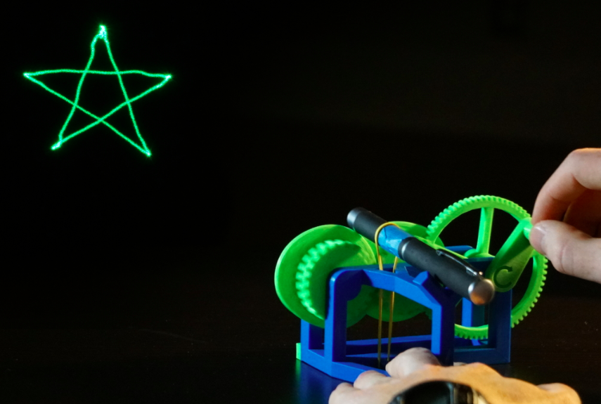
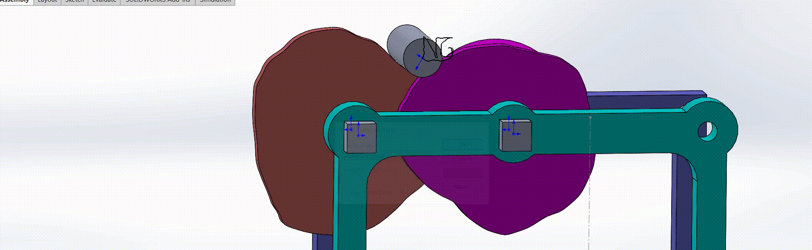

# Mid-quarter design challenge – A “real” laser-cam

In this homework you will use the skills you have developed so far to
design a two-cam mechanism that will trace a laser along a shape of your
choice. For sections 1-2 you will find “HW_4_boiler_plate.m” very useful. For
sections 3-5 you will use the solidworks parts files in “laser_cams.zip”.

This project is directly inspired by the awesome mechanical laser show project on thingverse [here](https://www.thingiverse.com/thing:2383299)

## Part 1: Path tracing

In this part you will generate a $(x_i, y_i)$ contour from hand selected
keypoints.

1.  Generate a list of $(x, y)$ coordinates that trace out the letters
    of your first and last name (your initials). This can be done using
    the provided matlab code, for best results keep the pattern within
    the dashed square region. Make sure to use at least 25 points and
    make sure to keep them closely spaced.

2.  Save this list of $x, y$ points to a comma separated text file
    (*hint: use dlmwrite*).

3.  Provide a plot of $x_i$ and $y_i$ versus $i$. Use the $\circ$
    symbol for these coordinates.

    
    
## Part 2: Cam profile generation (matlab)

Now we have to turn our desired $(x_i, y_i)$ coordinates into the
profiles for the left and right cams.

1.  Write out the equation for the $x$ and $y$ coordinates of the
    vertex laser center from the triangle diagram below. 
    
    {width=".55\linewidth"}

2.  Solve these equations for the $A_i$, $\alpha_i$, $B_i$, and
    $\beta_i$ which are the instantaneous lengths and angles of the
    triangle that define the laser in the desired $(x_i, y_i)$ position.
    

3.  Write out the kinematic relationship between the triangle angles
    $\alpha_i$, $\beta_i$, and the angle of the radius in the cam
    coordinate system $\theta_i^L$, and $\theta_i^R$ for the left and
    right cams respectively.

4.  Write a matlab function to return the polar coordinates of the left
    and right cam profile ($A_i$, $\theta_i^L$) and ($B_i$,
    $\theta_i^R$) from the following input: a series of $(x_i, y_i)$
    coordinates, an arbitrary follower radius $r_F$, and an arbitrary
    base circle radius $r_B$.

5.  Generate the cam profiles using your function from your hand
    selected data. The input should be your $(x_i, y_i)$ pairs, using
    the $r_f$ and $r_B$ given above, and the output should be two sets
    of $x,y$ coordinates: $(x_i^{left}, y_i^{left})$ and
    $(x_i^{right}, y_i^{right})$.

6.  Save the $(x_i^{left}, y_i^{left})$ and $(x_i^{right}, y_i^{right})$
    points to individual comma-separated text files called
    *cam_left.txt*{} and *cam_right.txt*.

7. Check that your cam motion looks correct with code provided at the end of the matlab script provided (see gif below for Prof. G's trace).

8.  Turn in a plot of your cam profiles generated from hand selected
    data.
    

## Part 3: Cam profile generation (solidworks)

We now need to input our matlab defined cam shapes into solidworks.

1.  Download and open the zip file with the solidworks parts
    “laser_cams.zip”.

2.  We now need to generate the cam profile. Open the left cam
    solidworks file.

3.  In the top menu, select *Insert* $\rightarrow$ *Curves*
    $\rightarrow$ *Curve through XYZ points*.

4.  Edit the cam sketch curve to follow the points you generated from
    matlab. (*You can use convert entities to turn the curve into a
    sketch line that can be extruded.*)

5.  Rebuild the cam once you have generated the new cam profile.

6.  Repeat for the right cam.

7.  Assemble the solidworks parts as shown in the diagram below. Use
    mating constraints to align the parts.

8.  Provide a snapshot of your cams in the assembly.

## Part 4: Motion study (solidworks)

Lastly, we want to make a cad representation of our follower and use the
*cam-follower* mate constraint in solidworks to generate a motion
study of our cam assembly.

1.  For the laser to track the cams we need to add a cam constraint to
    both cam faces:

    1.  Make one flat face of the laser coincident with the flat face of
        the front bracket.

    2.  Add a cam constraint with the round face of the cylinder as the
        follower, and the profile face of the left cam as the cam.
        (*Hint: the cam constraint is under the mechanical dropdown
        selection in the mate sidebar*).

    3.  Enforce a second cam constraint between the cylinder and the
        right cam.

2.  Make a motion study:

    1.  In the solidworks tools toolbar import the “motion analysis”
        tool.

    2.  In the motion study toolbar on the bottom add a motor motion
        profile and select the left cam. Make the cam rotate about the
        center shaft at a rate of 5rpm.

    3.  Add a second motor motion to the right cam. Make sure this
        rotates in the opposite direction as the left cam.

    4.  Select the motion analysis drop down box on the left side of the
        motion study toolbar. Add a plot item to the motion study and
        make this plot item be a traced point. Select the laser cylinder
        face and make the point trace the center of mass of this face.

3.  Turn in a snapshot of the final motion profile with your traced
    curve (See below for Prof. G's snapshot and motion study). 

4.  Zip your parts, assembly file, and matlab code into one file and turn it into the lab email
    (mae150winter2018@gmail.com) with the subject “HW4 - Your Name”.

   
   

## Part 5: 3D print your cams (extra credit!)

For 3 points extra credit 3D print your left and right cams and bring
them to class on the day homework is due. You are welcome to print the
full assembly for your own use but we only need the cams for the extra
credit!
